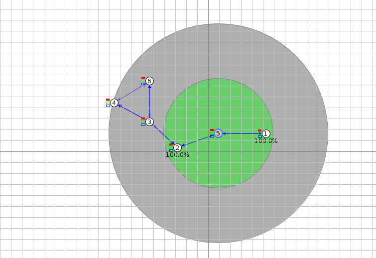
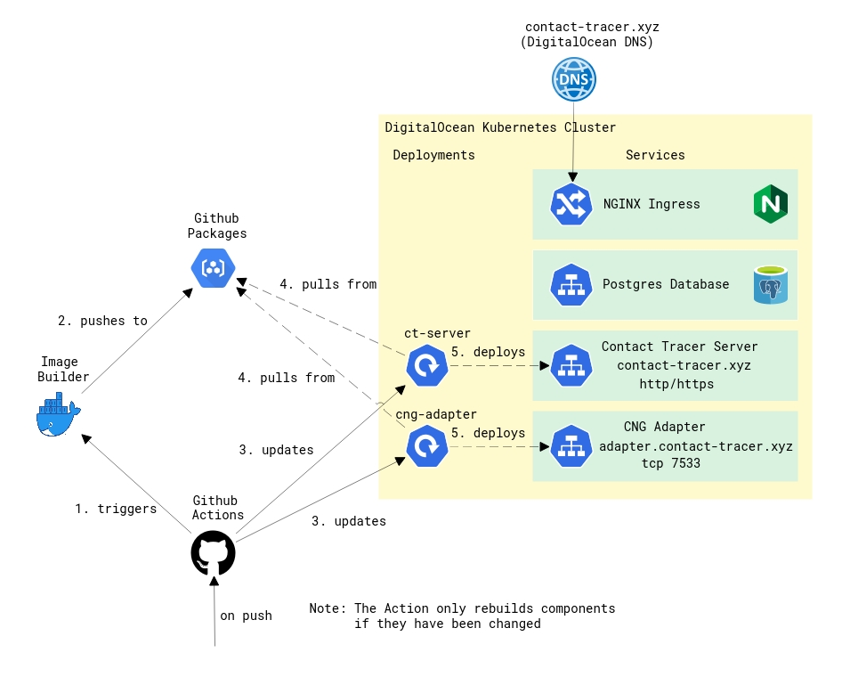

# IoT Contact Tracer
A decentralized contact tracing system, inspired by [DP-3T](https://github.com/DP-3T/documents) and Apple/Google's [Exposure Notification](https://en.wikipedia.org/wiki/Exposure_Notification), featuring:

* `server`: A server storing exposed identifiers
* `cng-client`: An embedded client based on the [Contiki-NG](https://github.com/contiki-ng/contiki-ng) os
* `cng-adapter`: An adapter that mediates between the embedded client and the server
* `mobile-client`: A mobile client for Android/iOS, using Flutter

> Cooja Simulation of the Contiki-NG client nodes

## How it works
Each client node periodically generates pseudorandom 16-bit identifiers (referred to as "rolling identifiers") and and distributes the most recent identifier at a fixed interval. There are two protocols involved here:

* The Contact Tracing Protocol
    * Each message consists of an unframed, 16-bit integer representing an identifier
    * Every node receiving such a message is expected to store it for exactly 14 days
    * Supported transports:
        * Contiki's Nullnet
            * through the `cng-client`
        * iBeacons
            * using the last 2 bytes of the UUID for the payload
            * through the `mobile-client`
* The REST/JSON API
    * Currently supports two (public) endpoints:
        * `/api/v1/exposures` (`GET`/`DELETE`)
        * `/api/v1/exposures/:id` (`GET`/`PUT`/`DELETE`)

> Note that the different contact-tracing transports are not yet compatible.

## Continous Deployment
This project is continously deployed using GitHub Actions, GitHub Packages and a Kubernetes cluster hosted by Digitalocean.

